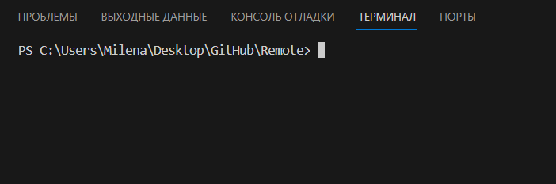

# **Работа с удаленными репозиториями**
1. Создать аккаунт на GitHub.
Если у вас еще нет аккаунта на GitHub, то нужно его создать. Для этого нужно:
 * перейти на сайт [GitHub](https://github.com) и нажать кнопку "Зарегистрироваться",
   
   
 * ввести адрес электронной почты,
   
   
 * придумать пароль и ввести имя пользователя.
   

 * проверить свою учетную запись решив головоломку,
 * после проверки учетной записи нажмите кнопку "Создать учетную запись ",
 * затем GitHub отправляет код запуска по адресу электронной почты. Введите код запуска в диалоговом окне "Ввод кода ", а затем нажмите клавишу ВВОД.
   
Ура! Вы создали учетную запись.
   
2. Создать локальный репозиторий.

Для создания локального репозитория необходимо создать и открыть пустую папку. При открытии терминала мы увидим, что это еще не локальный репозитоий. Это мы можем увидеть в пути:  
 или там же написать команду `git status`. 

В нашей папке нужно создать еще папку и назвать его. Затем нужно снова открыть терминал. Это можно сделать следующим образом:`навести курсор на папку > нажать правой кнопкой мыши > нажать "Открыть во встроенном терминале"`. 

Затем в этой папке нужно создать файл и можно начать работать с ним.

3. Создать удаленный репозитоий.

Вы создали локальный репозиторий, теперь, вам нужно добавить его на Github, тем самым вы фактически создадите удаленный репозиторий.

Перейдите на [GitHub](https://github.com) и войдите в свой аккаунт. Нажмите кнопку "New repository". На открывшейся странице введите имя репозитория и нажмите кнопку "Create repository".

GitHub нам предложит ввести 3 команды в локальном репозитории:
```Bash
git remote add origin https://github.com/username/myproject.git
```
Данная команда добавит удаленный репозиторий с именем origin, который указывает на ваш Github-репозиторий. Пока мы только добавили запись об удаленном репозитории.

```Bash
git branch -M main
```
Данная команда переименовывает вашу текущую ветку master в main.

Теперь можно выполнить команду git push, чтобы отправить все ваши изменения на удаленный репозиторий:
```Bash
git push -u origin master
```
4. Связать удаленный репозиторий с локальным.

Добавить удаленный репозиторий к проекту:
```Bash
git remote add <имя репозитория> <url-адрес репозитория в сети>
```

Для получения и слияния изменений из удаленного репозитория используется команда `git pull`.

Отправить изменения локального репозитория в удаленный `git push`.

```C#
while(count < 0)
{
count++;
}
```

